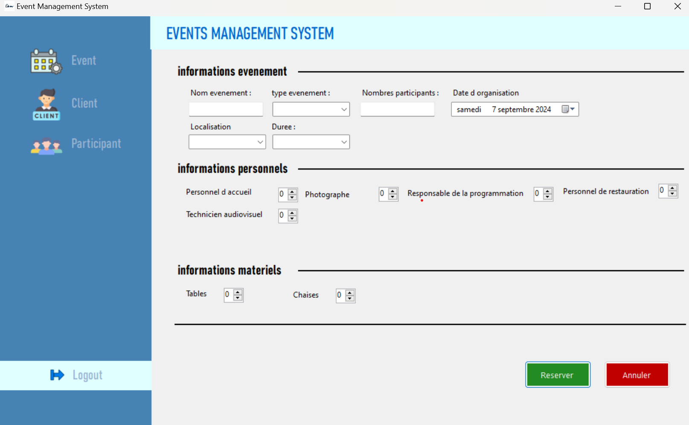
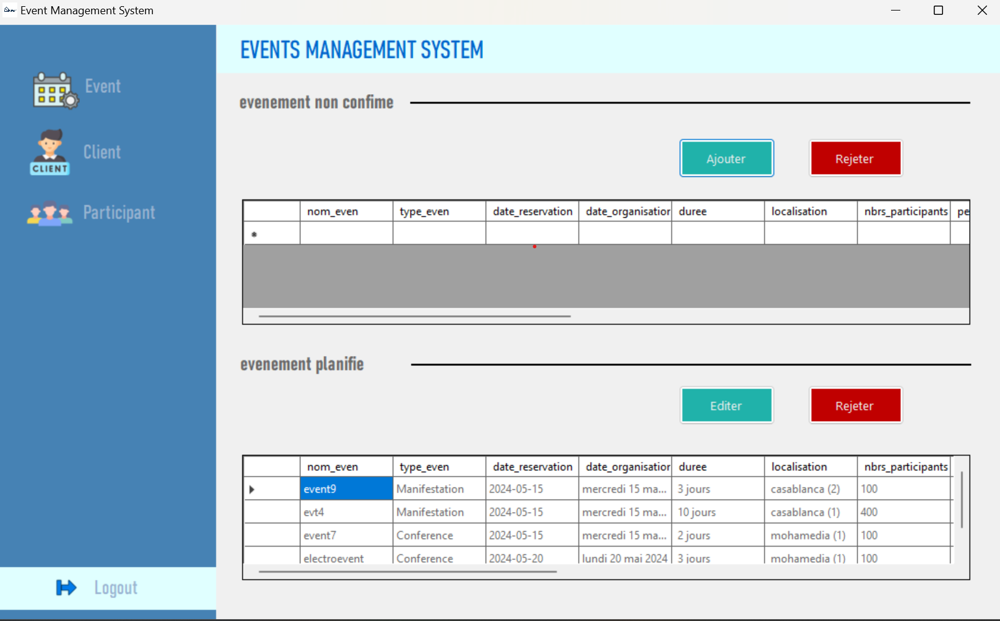
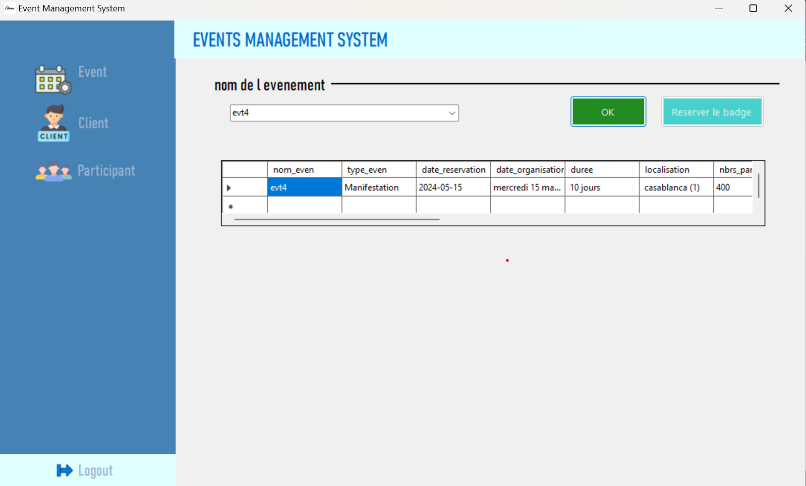

# DreamFete - Event Management Platform

**DreamFete** is a desktop application developed using **Visual Basic .NET**. It is designed to manage various types of events, whether they are weddings, conferences, or simple gatherings. The platform simplifies event management by allowing users to add event details through a form and view the data in a well-organized table.

## Screenshots

# Clients



# Events



# Participant




## Features

### 1. Event Management
DreamFete allows users to manage multiple types of events, including:
- **Weddings**
- **Conferences**
- **Other Events** (Birthdays, parties, meetings, etc.)

### 2. Event Form
The platform provides an easy-to-use form where users can input event details such as:
- **Event Name**
- **Event Type** (Marriage, Conference, or Custom Event)
- **Date**
- **Location**
- **Number of Attendees**
- **Additional Notes or Requirements**

### 3. Event Data Display
Once the event is added, the platform organizes all event data in a tabular format, providing a clear overview of:
- Event details
- Date and time
- Location
- Event type
- Attendance details

Users can easily manage this data with functions to view, edit, or delete specific events.

## Technology Stack

- **Programming Language**: Visual Basic .NET
- **IDE**: Visual Studio
- **Database**: SQLite (or other local database options like Access)

## Getting Started

### Prerequisites
- **Windows OS** (Compatible with Windows 7, 8, 10, 11)
- **Visual Studio** with .NET Framework

### Installation

1. **Clone the repository**:
   ```bash
   git clone https://github.com/yourusername/DreamFete.git
